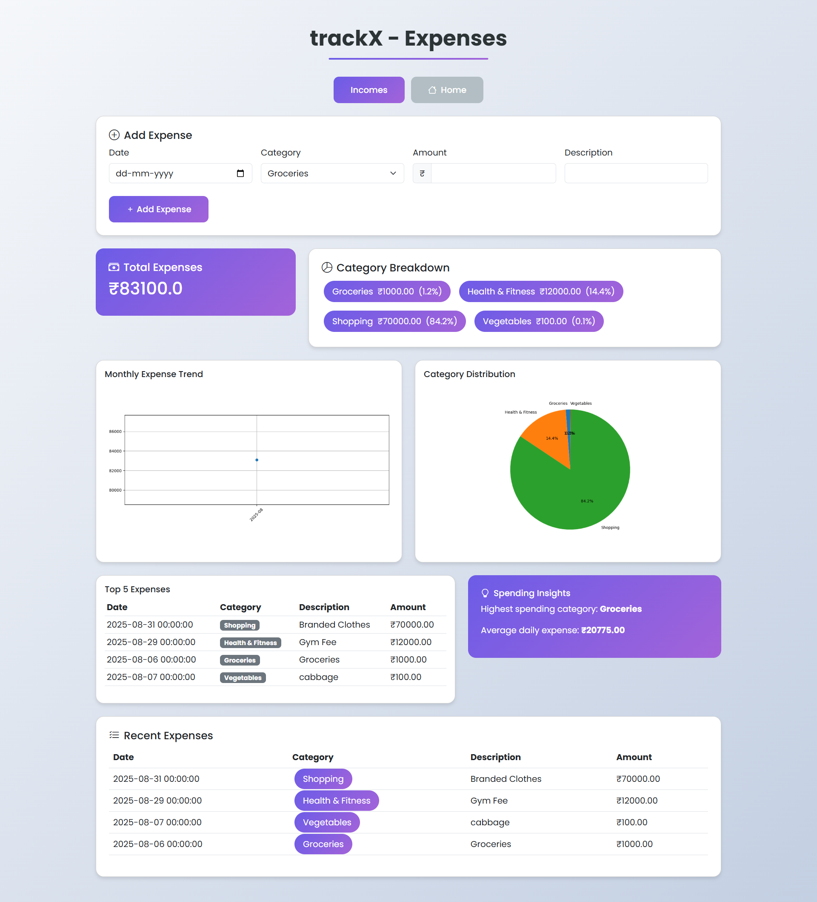
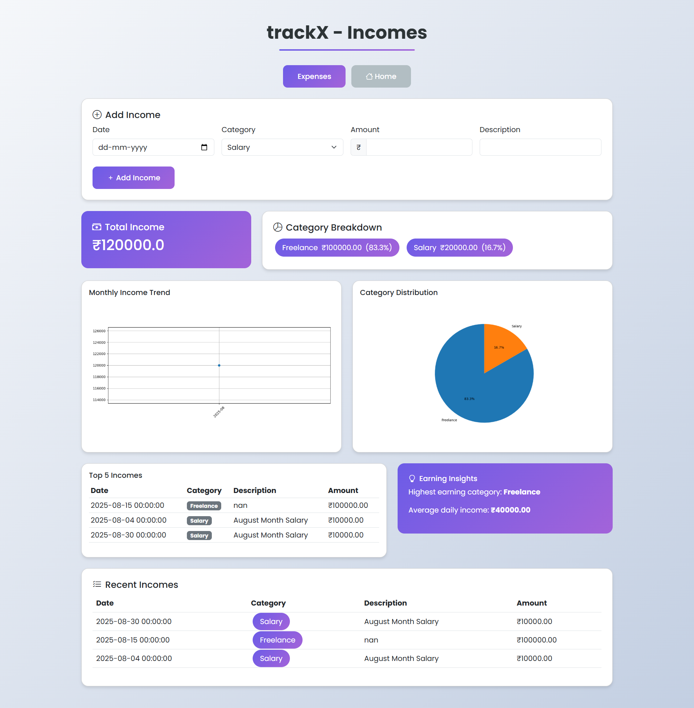
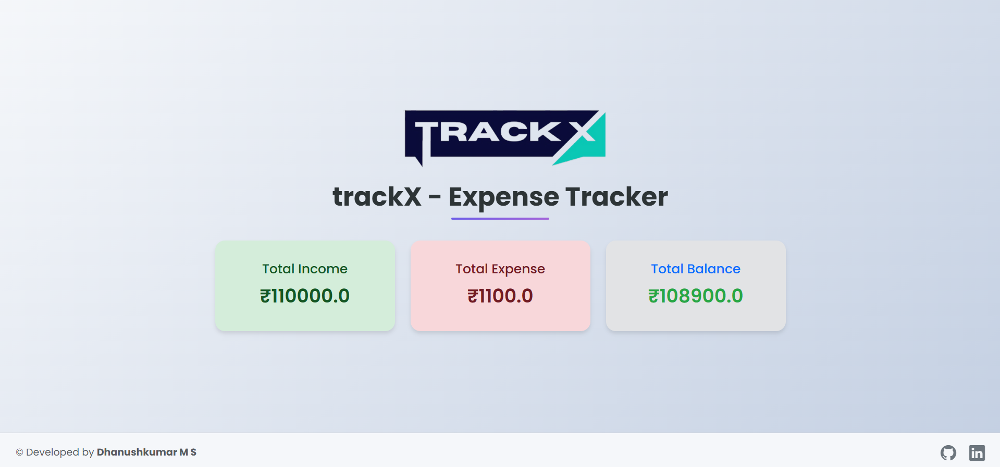
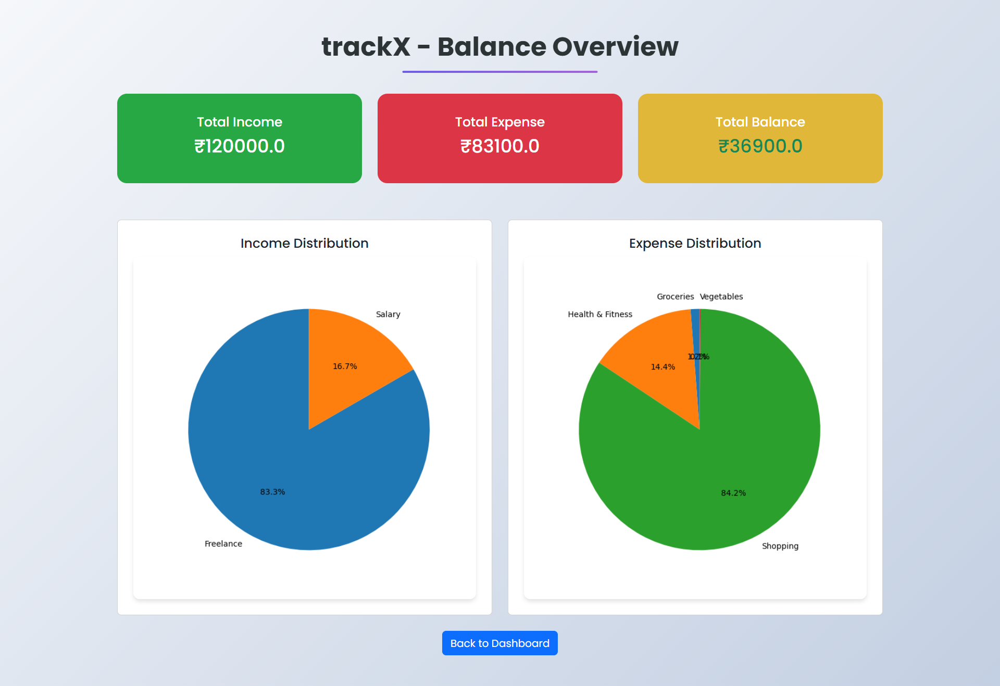

# 🧾 TrackX - Smart Expense Tracker

<p align="center">
  
</p> 


TrackX is a simple and powerful **expense tracking application** designed to help you manage your daily expenses, visualize spending patterns, and stay on top of your budget. With a clean UI and efficient performance, TrackX ensures you never lose track of your finances.

---

## 🛠️ Tech Stack

  
  
  
  
  
  
  
  
 


---

## 📸 Screenshots

<div align="center">

|   |  |
|----------------------------------------------|-----------------------------------------|
| |  |

</div>

---

## ⚙️ Installation & Setup

Follow these steps to run **TrackX** locally:

1. Clone the repository:
   ```bash
   git clone https://github.com/your-username/trackx.git
   ```

2. Navigate into the project folder:

   ```bash
   cd trackx
   ```
3. Install dependencies:

   ```bash
   npm install
   ```
4. Start the development server:

   ```bash
   npm run dev
   ```
5. Open the app in your browser at `http://localhost:5173/`.

---

## 🚀 Future Enhancements

* 📊 Add **data visualization** charts for monthly/yearly spending.
* 🌐 Enable **multi-user login & authentication**.
* 💾 Integrate with a **backend database** for persistent storage.
* 📱 Launch a **mobile app version** for Android and iOS.
* 🔔 Implement **budget alerts and notifications**.

---

## 📜 License

This project is licensed under the **MIT License**.
See the [LICENSE](./LICENSE) file for more details.

---

## 👨‍💻 Author

**Dhanushkumar M**

---
